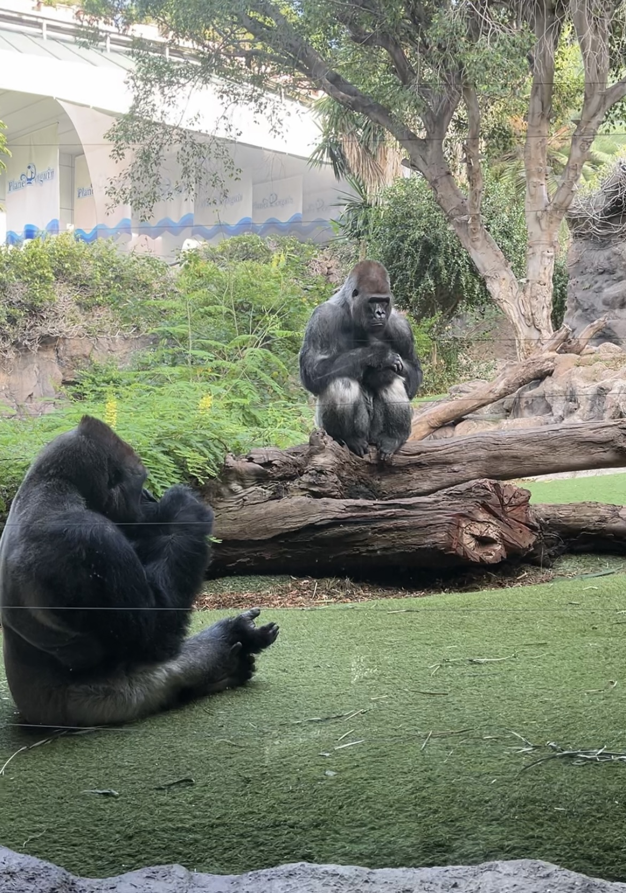

<<<<<<< HEAD
# TFM

**Title**: Development of Fault Detection and Prediction Machine Learning Models in Smart Grids enviroments.  
**Tutor**: [Elisa Rojas Sánchez](https://scholar.google.es/citations?user=Dgn0ShwAAAAJ&hl=es)  
**Tutor**: [David Carrascal Acebron](https://scholar.google.com/citations?user=__rsKBoAAAAJ&hl=es)  
**Master Degree**: Telecommunication Engineering, University of Alcalá (UAH) 

 
 
 

  

cd SustData
./runtests.sh
=======
# TFM

**Title**: Development of Fault Detection and Prediction Machine Learning Models in Smart Grids enviroments.  
**Tutor**: [Elisa Rojas Sánchez](https://scholar.google.es/citations?user=Dgn0ShwAAAAJ&hl=es)  
**Tutor**: [David Carrascal Acebron](https://scholar.google.com/citations?user=__rsKBoAAAAJ&hl=es)  
**Master Degree**: Telecommunication Engineering, University of Alcalá (UAH) 

 
 
 

  

cd SustData
./runtests.sh
>>>>>>> 6c894d1f80fb99633615695e9f2855142f74f1e0
